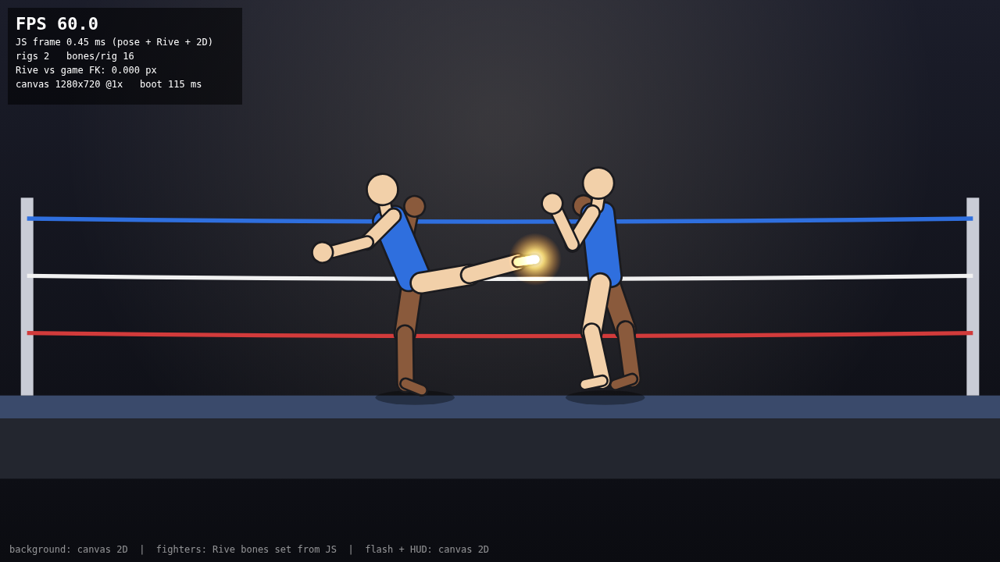
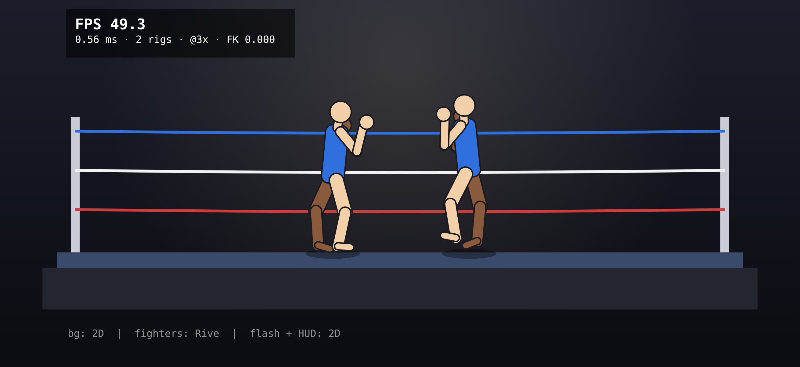

# Rive bone-control proof of concept

Question: can the game's own code drive a Rive character's bones every frame,
with Rive only drawing?

**Yes.** With the low-level web runtime (`@rive-app/canvas-advanced` 2.43.1),
`artboard.bone(name).rotation = radians` works directly. None of the
fallbacks (view-model bindings, state-machine blend inputs, Rive scripting)
are needed.



## Files

| File | What it is |
| --- | --- |
| `fighter-rig-test.riv` | The placeholder rig: artboard `Fighter`, 600×600, 16 bones, 15 shapes |
| `rig-test.html` | The test page, fully self-contained (2.69 MB). Open it straight from disk. The buttons at the bottom right switch the fighter count (2 / 20 / 100) and the resolution; `?rigs=20` and `?dpr=2` set the starting values. |
| `src/rig-test.src.html` | Readable source of the page (placeholders instead of the inlined blobs) |
| `tools/build-rig.mjs` | Generates `fighter-rig-test.riv` (bones, shapes, colours, draw order) |
| `tools/riv-writer.mjs` | Minimal writer for Rive's binary `.riv` format |
| `tools/build-html.mjs` | Inlines the runtime JS, `.wasm` and `.riv` into `rig-test.html`. `--artifact <file>` also writes a copy without the `<html>`/`<head>`/`<body>` wrapper, for hosts that add their own (claude.ai Artifacts). |
| `tools/verify.cjs` | Headless Chromium checks (desktop and iPhone 17 Pro emulation) and FPS measurement |

Rebuild: `node tools/build-rig.mjs && node tools/build-html.mjs`.
Verify: `NODE_PATH="$(npm root -g)" node tools/verify.cjs` (needs `npm i -g playwright`).

## How the rig was made

No Rive MCP server was connected to the session that built this, so the rig
was not built in the Rive editor. `tools/build-rig.mjs` writes the `.riv`
directly, using the type and property keys from rive-runtime's generated
headers. The real runtime loads it and draws it correctly (checked below).
The file has never been opened in the Rive editor.

## Rotation convention

- **Units: radians.** The editor shows degrees; the runtime API takes radians.
- **Positive = clockwise on screen.** Rive's y axis points down. 0 means the
  bone points along its parent's +x axis.
- **Relative to the parent bone.** Each bone's world transform is
  `parentWorld × rotate(rotation)`, placed at the parent's tip.
- Setting `rotation` **replaces** the rest value stored in the file. It is not
  an offset from the rest pose.
- If the game computes absolute angles in character space (facing right,
  0 = forward, 90° = down):
  `bone.rotation = (absAngle[child] − absAngle[parent]) × π/180`.
  For the pelvis, use its own absolute angle.
- Facing: `pelvis.scaleX = -1` mirrors the whole rig, so the same angles
  work for both facings. Draw order stays the same, so the "f" limbs stay in
  front.

The page cross-checks this every frame. It runs its own forward kinematics
from the angles it sets and compares the foot tip with the foot tip Rive
computes (`bone.worldTransform()`). The two agree to within 0.001 px.

## Bones

Shoulder and hip joints are **RootBones**, because they need their own x/y
offset. A plain Bone always starts at its parent's tip. `artboard.bone(name)`
finds both kinds. Use `artboard.rootBone(name)` when you need `.x` or `.y`.

| Bone | Type | Parent | Length | Offset in parent | Rest rotation |
| --- | --- | --- | --- | --- | --- |
| `pelvis` | RootBone | artboard | 0 | x 300, y 493 | 0 |
| `torso` | Bone | pelvis | 70 | at pelvis | −90° (up) |
| `neck` | Bone | torso | 8 | torso tip | 0 |
| `head` | Bone | neck | 30 (circle r15 centred on it) | neck tip | 0 |
| `fUpperArm` | RootBone | torso | 36 | 65 along torso, 5 forward | 180° (hanging) |
| `fForearm` | Bone | fUpperArm | 34 | tip | 0 |
| `fHand` | Bone | fForearm | 20 (glove r10 centred on it) | tip | 0 |
| `bUpperArm` | RootBone | torso | 36 | 65 along torso, 6 back | 180° |
| `bForearm` | Bone | bUpperArm | 34 | tip | 0 |
| `bHand` | Bone | bForearm | 20 (glove r10) | tip | 0 |
| `fThigh` | RootBone | pelvis | 47 | 5 forward, 4 down | 90° (down) |
| `fShin` | Bone | fThigh | 48 | tip | 0 |
| `fFoot` | Bone | fShin | 17 | tip | −90° (forward) |
| `bThigh` | RootBone | pelvis | 47 | 4 back, 4 down | 90° |
| `bShin` | Bone | bThigh | 48 | tip | 0 |
| `bFoot` | Bone | bShin | 17 | tip | −90° |

"Forward" in the torso's space is its local +y, because the torso points up.
The head and hand lengths were not in the spec. I used the circle's diameter,
so each bone spans its circle. In the rest pose the heel touches y = 600.

Draw order, back to front: back arm, back leg, torso, front leg, head (and
neck), front arm. Colours: light `#F2D0A9` for "f" limbs and the head, dark
`#8A5A3C` for "b" limbs, blue `#2F6FDE` for the torso. Every shape has a 2 px
outline.

## Integration recipe (what `rig-test.html` does)

```js
const rive = await RiveCanvasAdvanced({ instantiateWasm(imports, done) {
  WebAssembly.instantiate(wasmBytes, imports).then(r => done(r.instance, r.module));
  return {};
}});
const file = await rive.load(rivBytes, undefined, false); // false: no Rive CDN loader
const artboard = file.artboardByName("Fighter");           // new instance per fighter
const bones = Object.fromEntries(JOINTS.map(n => [n, artboard.bone(n)]));
const pelvis = artboard.rootBone("pelvis");
const renderer = rive.makeRenderer(canvas);

function frame(dt) {
  for (const n of JOINTS) bones[n].rotation = localAngleRadians[n];
  pelvis.x = x; pelvis.y = y; pelvis.scaleX = facing;   // 1 or -1
  artboard.advance(dt);                                 // recomputes transforms

  drawBackgroundWith2D(ctx);                            // 1. plain canvas 2D
  ctx.setTransform(1, 0, 0, 1, 0, 0);
  renderer.beginFrame(false);                           // 2. Rive (queued)...
  renderer.save();
  renderer.transform(camScale, 0, 0, camScale, camX, camY);
  artboard.draw(renderer);
  renderer.restore();
  rive.resolveAnimationFrame();                         //    ...painted here
  drawOverlayWith2D(ctx);                               // 3. plain canvas 2D
}
```

## Measured performance

These numbers come from headless Chromium in a Linux cloud container, with
software rendering and no GPU, at 1280×720. **They are not Mac numbers.** Open
`rig-test.html` on the Mac and read the counter in the top-left corner.

| Rigs | FPS | JS time per frame (pose + Rive + 2D) |
| --- | --- | --- |
| 2 | 60.0 (vsync cap) | ~0.45 ms |
| 20 | 60.0 | ~2.3 ms |
| 100 | ~44 | ~12 ms |

Startup (page start to first frame, including base64 decoding and wasm
compilation) took about 115 ms.

## Testing on the iPhone 17 Pro

The target device is the iPhone 17 Pro: 402×874 CSS pixels at 3× (a 1206×2622
canvas) with a 120 Hz screen.

- **Getting it onto the phone.** A copy is published as a private claude.ai
  Artifact that opens straight in Safari or the Claude app. A local HTML file
  opened from the Files app, or from a file attachment in the Claude app, only
  shows its source code. To test the file itself, serve it from the Mac:
  1. In this folder on the Mac, run `python3 -m http.server 8000`.
  2. Run `ipconfig getifaddr en0` to get the Mac's IP address.
  3. With the phone on the same Wi-Fi, open `http://<that IP>:8000/rig-test.html`
     in Safari.
  The page still makes no requests beyond itself.
- **Try landscape and portrait.** The page frames the fighters for either
  orientation and keeps them and the FPS counter clear of the Dynamic Island
  and home bar. On short screens (a phone in landscape) the counter shrinks to
  two lines.
- **Pixel density.** The page draws at the phone's full 3× by default. Tap
  "3× resolution" to step down to 2× and 1× and compare the cost; tap the
  fighters button for 20 and 100 fighters.
- **120 Hz.** Safari and in-app web views have historically capped
  `requestAnimationFrame` at 60 fps even on 120 Hz iPhones, so the counter
  will most likely read 60. That is the target anyway, because the game
  simulates at 60 steps per second. If it ever reads 120, draw the latest
  60 Hz pose, or interpolate between poses.
- **Deeper profiling.** On the phone, turn on Settings → Apps → Safari →
  Advanced → Web Inspector. Then, on the Mac, use Safari's Develop menu →
  your iPhone → the page, and record a Timeline.



`tools/verify.cjs` also runs the page in Chromium's iPhone 17 Pro emulation,
in portrait and landscape at 3×, with simulated Dynamic Island insets. That
checks layout only; it is not WebKit and not the phone's GPU.

## Gotchas

1. **The canvas renderer queues its drawing.** `artboard.draw(renderer)`
   doesn't touch the canvas. The queued calls run on `rive.resolveAnimationFrame()`,
   and only for renderers registered by `renderer.beginFrame()` or
   `renderer.clear()` that frame. If you skip that call, nothing appears and
   the queue keeps growing. The layering pattern is: 2D background, then Rive
   draws, then `resolveAnimationFrame()`, then the 2D overlay. Another option:
   2D context methods called on the renderer object (`renderer.fillRect(…)`)
   are queued in order with the Rive draws.
2. **`beginFrame()` clears by default.** Pass `false`, or it wipes the
   background you just drew.
3. **The context transform at resolve time is the base for Rive.** Rive's
   queued save/transform/restore calls apply on top of whatever transform
   `ctx` has. Reset it to identity first, and apply the camera and device
   pixel ratio with `renderer.transform(...)`.
4. **Turn off artboard clipping.** The page uses artboard space as world space
   (pelvis x/y are arena coordinates). This only works with clipping off:
   `clip` is false in this file, but the editor turns it on by default for new
   artboards. With clipping on, a fighter outside the 600×600 box disappears.
   The alternative is to keep the pelvis inside the artboard and translate the
   renderer per fighter.
5. **Shoulders and hips need RootBones.** Only a RootBone can sit at an
   offset. In the editor, that means starting a new bone chain and parenting
   its root to the torso or pelvis bone.
6. **Free what you get back.** `worldTransform()` returns a `Mat2D` on the
   wasm heap, so call `.delete()` on it or it leaks every frame. Call
   `artboard.delete()` when a fighter goes away.
7. **Call `artboard.advance(dt)` after setting bones and before drawing.** It
   recomputes the world transforms. Nothing else is needed: no animation or
   state machine.
8. **`rive.load()` turns on a Rive CDN asset loader by default.** Pass
   `false` as the third argument so a file with hosted assets can never reach
   the network.
9. **Painted artwork:** plain images bound to bones should render with
   `drawImage`. From reading the runtime source, mesh-deformed (skinned)
   images appear to go through an extra offscreen WebGL canvas in the
   canvas-advanced build. Measure that once real art exists. The
   `webgl2-advanced` build is faster, but a WebGL canvas can't also take 2D
   calls. Then the game's 2D would need its own canvas stacked above and
   below the Rive canvas.
10. **iPhone app:** if the web view sets a Content-Security-Policy, the page
    needs `'wasm-unsafe-eval'` (to compile the wasm) and must allow the
    inline scripts.
11. **Only tested in Chromium.** Safari/WebKit (Mac Safari and the iPhone web
    view) was not tested here.
